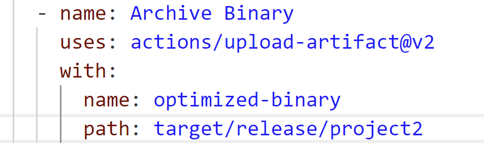
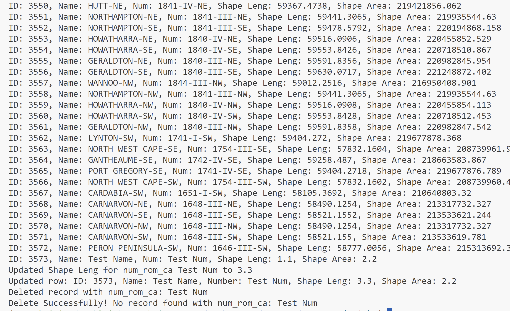
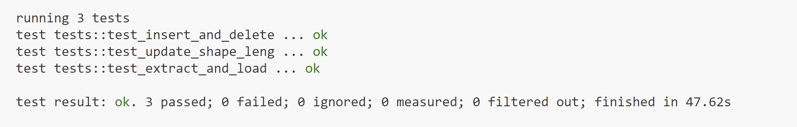

# 706_Project2_YL

This repository includes the main tasks for Project 2:

* `Makefile` is a configuration file used in Unix-based systems for automating tasks and building software. It contains instructions and dependencies for compiling code, running tests, and other development tasks.
* `.devcontainer` includes a Dockerfile and `devcontainer.json`. The `Dockerfile` within this folder specifies how the container should be built, and other settings in this directory may control development environment configurations.
* `Workflows` includes GitHub Actions, which contain configuration files for setting up automated build, test, and deployment pipelines for your project.
* `.gitignore` is used to specify which files or directories should be excluded from version control when using Git.
* `README.md` is the instruction file for the readers.
* `requirements.txt` is to specify the dependencies (libraries and packages) required to run the project.
* `Cargo.toml`: this is a byproduct when creating the Rust project, defining the versions of `reqwest` and `rusqlite` to be used.
* `main.rs`: use the ETL functions written in `lib.rs`.
* `lib.rs`: contains the main ETL functions: `extract` is used to retrieve data from a url (`25ktopomapseriesindex.csv`); `load_transform` is used to create a `.db` database; `connect` is used to connect and load data from the database. Next, `create_table`, `read`, `update_shape_length` and `delete` are functions that perform CRUD operations.
* `test_main.rs`: test the functions in `main.rs`
* `RustCICD.yml`: contains the workflow for testing, building, and linting the Rust code.

## Project description

* Write well-structured Rust source code and demonstrates a clear understanding of Rust's syntax and unique features.
* Demonstrate CRUD operations on the SQLite database.
* Utilize GitHub Copilot to build and run the whole program.
* Include a process that optimizes Rust binary as a GitHub Actions artifact and is downloadable: this is done by adding additional lines in `RustCICD.yml`.

## GitHub Copilot

Copilot is a powerful tool to write code in Rust. I find two aspects pretty helpful:

* I can use bring up a chat input to send request to Copilot. Then, it will give me some suggestions on scripting in Rust. Though the suggestions are not perfect and errorless, it provides me a template to write the code, which enhances my efficiency and avoids critical errors in the code.

* Copilot also brings up up-to-date suggestions on some contents, saving me a lot of time to use `make test` to check inappropriateness that might occur in my code.

## Workflow

The workflow is pretty similar to what I performed ETL using Python during the past weeks. In a nutshell, ETL+CRUD operations:
* Extraction: `extract` function in `lib.rs`
* Create table (CRUD operations): `create_table` function in `lib.rs`
* Load and transform: `load_transform` function in `lib.rs`
* Insert: `insert` function in `lib.rs` adds a new record in the `.db` database
* Read (CRUD operations): `read` function in `lib.rs`
* Update (CRUD operations): `update_shape_length` function in `lib.rs` updates `shape_length` filed in the `.db` database
* Delete (CRUD operations): `delete` function in `lib.rs`

## Project environment

* Use codespace for scripting
* To run the code, use the command `cargo run` in the terminal. Below is a showcase of the result:

## Check format & errors

1. make format

2. make lint

3. make test: I included test functions, `test_extract_and_load`, `test_update_shape_length`, and `test_insert_and_delete` in `test_main.rs` to test `extract`, `load_transform`, `update_shape_length`, and `insert` functions in `main.rs`.

## Video explanation

Link: